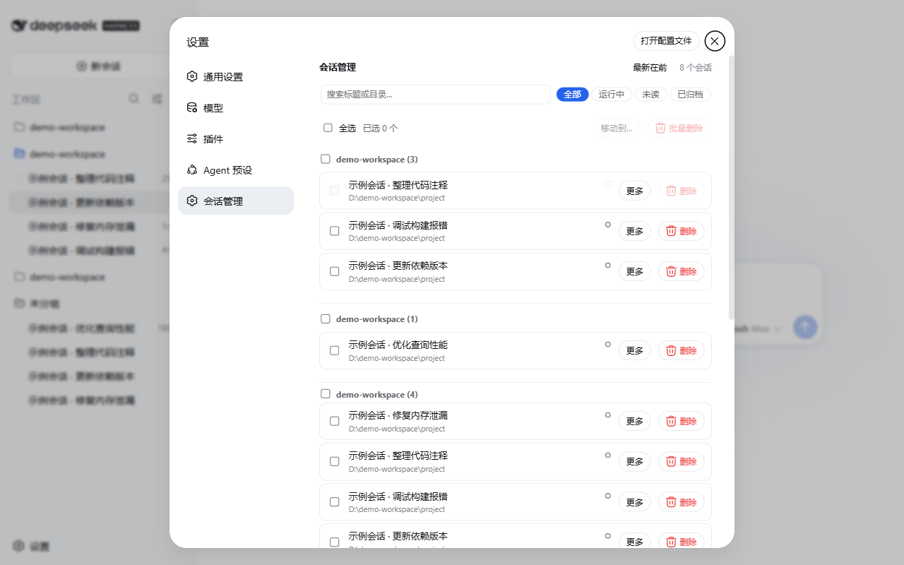
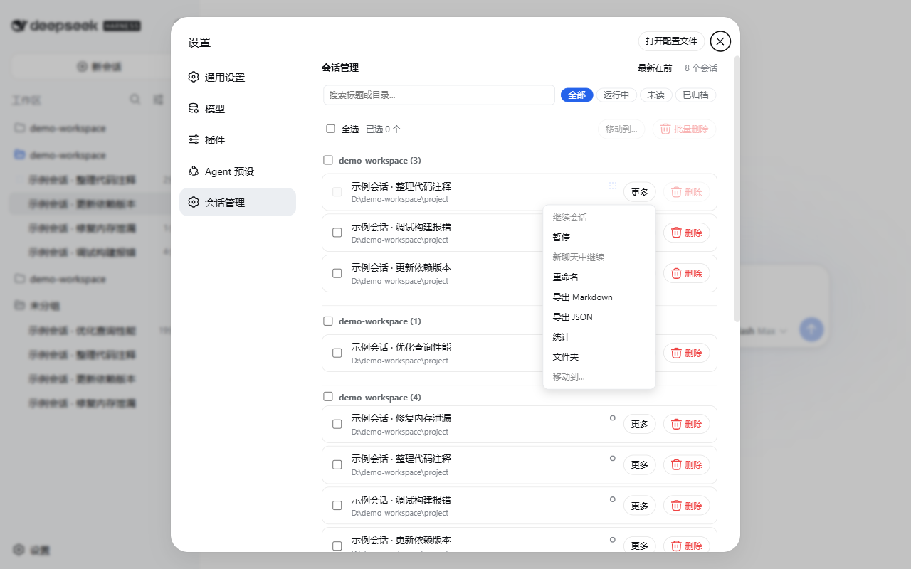
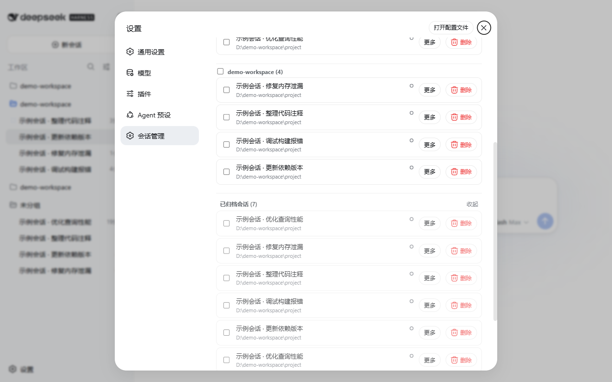
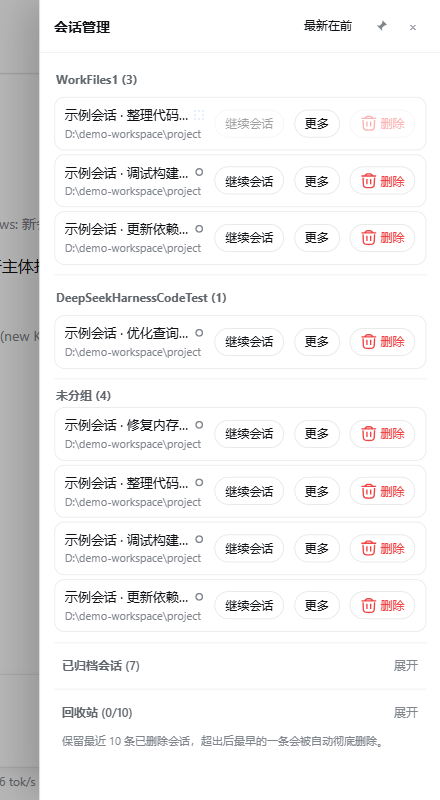

# 🗂️ dsh-session-manager

> One-stop session management for the DeepSeek Harness Web UI: delete (trash) / restore / rename / export / move between workspaces / batch actions, ready to use — **no DSH core changes**.

English | [中文](README.md)

[](https://github.com/qewregrfhnm/dsh-session-manager/actions)
[](https://github.com/qewregrfhnm/dsh-session-manager/releases)
[](https://github.com/qewregrfhnm/dsh-session-manager/releases)
[](LICENSE)
[](src)
[](#compatibility)
[](#compatibility)

## ✨ Highlights

| Capability | Description |
| --- | --- |
| 🗑️ **Delete / Restore / Purge** | Deletes go to a trash area (keeps the latest 10, restore or purge); archived sessions restore in one click |
| ✏️ **Session rename** | Written as an official `session/title` event — automatic retitling stops, survives restarts |
| 📥 **Export Markdown / JSON** | Markdown = readable transcript; JSON = lossless event log; one-click browser download |
| 📂 **Move to workspace** | Drag a session row onto a workspace header, or use "Move to…" (batch + **＋ New workspace**) |
| 🔍 **Search & filter** | Real-time title / directory filter + All / Running / Unread / Archived chips |
| 🔵 **Unread / read markers** | Manual unread, official waiting-input / completion dots; mark read in place |
| 📊 **Activity stats** | Per-session turns / message counts / tool calls / activity window |
| ⏯️ **Continue / Pause / Fork** | One-click continue (archived sessions auto-restore first), pause the running turn, fork a child chat |
| 🗂️ **Workspace management** | Grouping, drag to reorder, pin-to-top / rename / delete workspaces |
| ⚙️ **Global compaction threshold** | Applies to ALL agent presets; instant + persisted + reapplied on restart |

Also: **session drawer** in the conversation header (pinnable), **Delete this chat**, open log folders, orphaned-subagent cleanup, zh/en UI.

## 📸 Screenshots

> Demo UI with anonymized session titles and paths.

| Session Manager overview (Settings) | Row "More" menu |
| --- | --- |
|  |  |

| Archived sessions & trash | Session drawer |
| --- | --- |
|  |  |

## 📦 Install

### Requirements

- DSH CLI installed globally (`npm i -g @deepseek-ai/dsh`), `0.1.0-rc.6` or a same-generation `0.1.x` rc
- Node.js `^22.19.0 || >=24.0.0`, pnpm `>=9` (the DSH CLI forwards plugin management to pnpm)

### From a GitHub Release (recommended)

```sh
dsh plugin --profile web add 'https://github.com/qewregrfhnm/dsh-session-manager/releases/download/v0.4.1/dsh-session-manager-0.4.1.tgz'
```

> Latest version: see [Releases](https://github.com/qewregrfhnm/dsh-session-manager/releases) and swap the tag in the URL.

### From a GitHub tag

```sh
dsh plugin --profile web add 'github:qewregrfhnm/dsh-session-manager#v0.4.1'
```

### From a local directory / tarball

```sh
dsh plugin --profile web add /absolute/path/to/dsh-session-manager
# or, after packaging
cd dsh-session-manager && pnpm pack
dsh plugin --profile web add /absolute/path/to/dsh-session-manager-0.4.1.tgz
```

### Manual install (fallback if `dsh plugin` is unavailable)

`dsh plugin` just forwards to pnpm inside the profile directory and syncs `dsh.profile.bundles`:

```sh
cd ~/.dsh/profiles/web
pnpm add <spec-from-above>
# then append "dsh-session-manager" to dsh.profile.bundles in package.json
```

> **Restart `dsh web` after installing** (host plugin and client bundle load at boot).

## 🚀 Usage

### Session Manager in Settings

1. Open **Settings** (gear icon) → **Session Manager** in the left nav
2. Active sessions are grouped by workspace; bottom collapsibles: **Archived sessions** and **Trash**
3. Rows keep a single **Delete** button; everything else lives in the **More** menu:
   **Continue** (archived sessions auto-restore first) / **Pause** / **Restore** / **Fork** / **Rename** / **Export Markdown / JSON** / **Stats** / **Folder** / **Move to…**
4. Top **search box** + **status chips** (All / Running / Unread / Archived)
5. **Drag** a session row onto a workspace header to move it; select rows for **batch move / batch delete**
6. Workspace headers (hover): **pin to top / rename / delete**

### Rename & export

1. Row **More → Rename**: enter the new name — the title updates everywhere immediately
2. **More → Export Markdown**: downloads a readable transcript (turns / user / assistant / tool calls & results)
3. **More → Export JSON**: downloads the lossless event log (session header + all events with seq/time)

### Move a session to another workspace

1. **More → Move to…** → pick the target workspace, or **drag the session row** onto a workspace header
2. Log folder, session-header cwd, and workspace bookkeeping update atomically and survive restarts
3. **＋ New workspace (session directory)** registers the session's own directory as a workspace

> Limits: **running / loaded (live) sessions cannot be moved** — pause first, or restart `dsh web` to unload.

### General settings · compaction threshold

**Settings → General**: auto-compact at 17%–90% of the model window, keeping the latest 16% verbatim; applies to ALL agent presets, effective immediately and persisted.

### Conversation-header shortcuts

Top-right of any conversation: **Session drawer** (pinnable), **Trash**, **Delete this chat** (red).

## 🔧 How it works

| Layer | Implementation |
| --- | --- |
| Host | `src/index.ts` registers 10 routes: `POST /delete`, `POST /restore`, `POST /purge`, `GET /trash`, `POST /open-folder`, `POST /pause`, `POST /move-workspace`, `GET|POST /compaction-threshold`, `POST /rename` (live: official `sessionTitle.rename`; cold: appends an event frame + updates the persisted projection cache), `POST /export` (renders Markdown / JSON via `sessionPersistence.inspect`). Services: `ctx.sessionPersistence` / `ctx.workspaceRegistry` / `ctx.storageDomain` / `ctx.agentPresets` / `ctx.agents` |
| Client | `src/client/index.ts` registers a Settings section via the official `settings.section` slot; `useSessions` / `useWorkspaces` feeds; the drawer subscribes via `sessions.list` (ObservableSnapshot); purged ids are kept in localStorage so sessions do not "resurrect" after a refresh |

- **Rename**: titles are `session/title` log events (official `@deepseek-ai/dsh-session-title`; source `user` pins the title). Cold sessions get a host-appended event frame (seq continuation handles packed chunk rows) plus a `session_projcache` row so list rows and the sidebar update immediately
- **Export**: official `sessionPersistence.inspect` gives a decoded, balanced event view; builders are pure functions (`src/export.ts`, unit-tested)
- **Move to workspace**: rewrites the zstd log's **first frame** to exactly the one-line session header (with `cwd` updated) and keeps event frames; the directory is renamed into the target workspace; bookkeeping is updated (detach + attach). Any failure rolls back: **rename the directory back first**, then restore original bytes — never delete-then-rename
- **Continue on archived sessions**: the official workspace projection clears the selection while the current session stays archived, so the plugin restores (un-archives) and refreshes the workspace baseline before opening
- **Unread**: manual unread set lives in the shared `dsh.session-unread.v1` localStorage key; official dots are driven by `pendingInteraction` / `completed` / `running`
- **Compaction threshold**: persisted in the storage domain and written to the user preset's `agent.cordis.yml` (system presets stay read-only); applied to every preset's compaction config in the `agent/pre-step` hook
- Trash entries live in `~/.dsh/storages/dsh_delete_session.json`; files in `~/.dsh/dsh-delete-session-trash/`
- No system-prompt changes, no new model tools — zero impact on tokens and model behavior

## 🔒 Privacy & security

- **Fully local**: every operation touches only files under `~/.dsh` and browser localStorage — **no telemetry, no analytics, no network requests**
- Move / export / rename only operate on local logs and metadata; nothing is uploaded
- The plugin never modifies DSH core; uninstalling leaves all sessions untouched

## ⚠️ Limitations

- Running sessions cannot be deleted (button disabled + server-side refusal)
- Running / loaded (live) sessions cannot be moved — pause first, or restart `dsh web`
- Subagent sessions can be deleted (when not running), including orphans
- Purged session ids remain in localStorage and in the archive set (harmless, prevents refresh resurrection)
- Sidebar unread dots match by title text; duplicate titles share a dot (the panel / drawer match by real session id and are unaffected)

## 📄 Compatibility

- Targets DSH `0.1.0-rc.6` (`settings.section` / `settings.general.item` / `conversation.session.header.utilities` slots; `ctx.sessionPersistence` / `ctx.workspaceRegistry` / `ctx.agents` / `ctx.storageDomain` / `ctx.agentPresets` services)
- Runtime `@deepseek-ai/*` packages are provided by the DSH host (resolved from the global install)
- Adaptations may be needed after DSH upgrades change slots or service APIs

## 🛠️ Development

```sh
pnpm install        # deps come from the npm registry — builds on any machine
pnpm run check      # typecheck + test + build
pnpm pack           # produces dsh-session-manager-<version>.tgz (for GitHub Releases)
```

- `lib/` is committed build output — rebuild and commit it after source changes (so `github:` installs work without a build step)
- Every push / PR runs `pnpm run check` on GitHub Actions (see the build badge)
- Changelog: [CHANGELOG.md](CHANGELOG.md)

## 🤝 Contributing & license

- Issues / PRs welcome: feature requests, bug reports, translations
- Forked from [dream12347/dsh-session-manager](https://github.com/dream12347/dsh-session-manager) (MIT) — thanks to the original author
- Released under the [MIT License](LICENSE), © dsh-session-manager contributors
